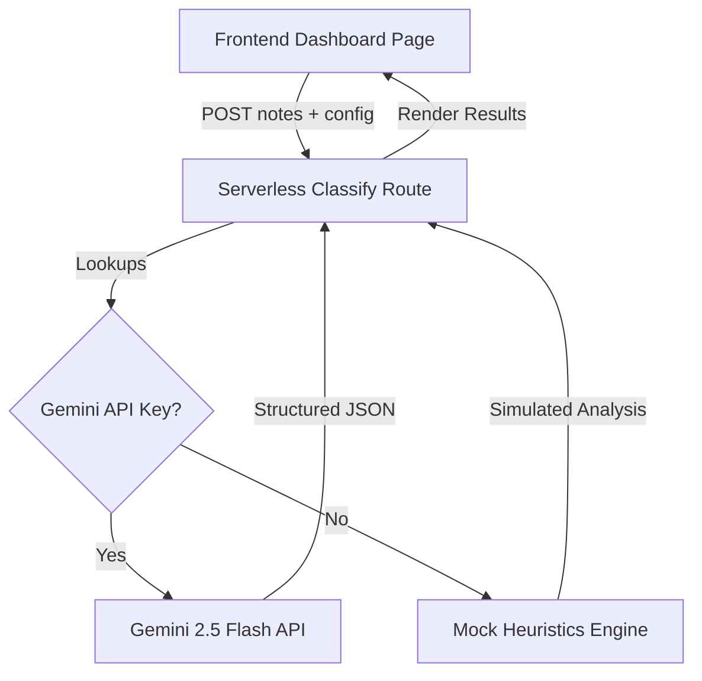

# Stagecraft — AI Stage Classifier & Sales Coach Wedge POC

Stagecraft is an AI-native CRM positioned as a "revenue operating system" — combining an AI sales manager, coach, and customer success director into one system. This Proof of Concept (POC) validates the core "wedge" feature: **interpreting free-text representative notes into structured sales pipeline stages based on per-tenant rules and sales frameworks.**

---

## 🚀 Quickstart Guide

This application is built as a self-contained Next.js web application utilizing Vanilla CSS.

### Prerequisites

- Node.js (v18.x or later)
- npm (v9.x or later)

### Local Development Setup

1. **Install Node modules:**
   ```bash
   npm install
   ```

2. **Run the local development server:**
   ```bash
   npm run dev
   ```
   Open [http://localhost:3000](http://localhost:3000) in your browser.

3. **Production Build & Verification:**
   ```bash
   npm run build
   npm run start
   ```

---

## 🛠️ Architectural Blueprint

To respect the constraints of a bootstrap venture, the POC is built with a zero-database, serverless architecture.



### Key Components

- **Frontend (`src/app/page.js`):** React dashboard handling states, timeline progression visualization, localStorage syncing, native Web Speech dictation, and manual overrides.
- **Backend API Route (`src/app/api/classify/route.js`):** Resolves environment variables and request headers for the Gemini API key, triggers the LLM adapter, and handles error boundaries.
- **LLM Service (`src/services/llm.js`):** Compiles prompts dynamically injecting tenant configurations, runs the fetch connector to Gemini Developer API, and provides a heuristic fallback model when offline or key-less.
- **Static Configuration (`src/data/default_tenants.json`):** Contains default sales processes, templates, and meeting summaries for three separate industries: Biotech BD, Healthcare Enterprise, and Legal Consultations.

---

## ⚡ High-Fidelity Demo Walkthrough

Faisal can demo this to sales leaders in under 3 minutes:

1. **Onboarding & Configuration (Minute 1):** 
   - Open the web app. Choose **BioGenesis Partners (Biotech BD)** from the select box.
   - Click **Customize Stages** in the upper right. Note that **MEDDIC** is their active framework.
   - Add a custom requirement or change a stage name. Enter a personal Gemini API Key if you want to run live LLM requests. Click **Apply Stage Configurations**. (Configs persist in browser `localStorage`).
2. **Representative Input (Minute 2):**
   - Click the **Load Sample meeting note** dropdown and pick **Successful Validation & Champion Engaged**. The text box will populate with a realistic immunology representative notes sheet.
   - *Alternative:* Click the **Microphone (🎙️)** button and speak a summary of a call to showcase native voice dictation.
3. **Structured AI Judgment & Override Loop (Minute 3):**
   - Click **Analyze Opportunity**. In a few seconds, the results load.
   - Review the deal stage highlighted on the visual timeline, the confidence score, the manager's coaching rationale, and risk tags (e.g. *Single-threaded*).
   - Look at the **Framework Checklist** (MEDDIC) showing which elements are Green (confirmed), Yellow (partial), or Red (missing) with corresponding direct quotes.
   - Try the **Pipeline Override Loop** at the bottom. Disagree with the stage, select another, enter a correction note (e.g. *Met CFO Robert Chen today*), and apply the correction. The timeline and logs update instantly.

---

## 🏗️ Extension Guide: Transition to Production (Phase 2)

When moving beyond this initial wedge validation POC, the codebase can easily scale:

### 1. Database Integration
Swap out `localStorage` for a real relational database (e.g., PostgreSQL using Supabase or Prisma ORM).
- Create a `Tenant` model to store organization metadata and sales stages.
- Create an `Opportunity` (Deal) model to store stages, close dates, value bands, and active states.
- Create an `Activity` model to log representative meeting summaries and link them to opportunities.

### 2. Upgrading to the Full "Sales Brain"
The Stage Classifier evaluates individual notes. The full **Sales Brain** acts as the synthesis layer that runs on top of this structured data to generate pipeline-wide coaching reviews:
- Create a cron task (or serverless scheduler) that runs every Sunday night.
- Query all active opportunities for a tenant.
- Compile their historical activity logs and framework evaluations.
- Construct a summary prompt containing the history.
- Invoke the LLM to output a Monday Morning Brief (`CoachingBrief`) ranking deals by risk, outlining gaps, and prescribing a checklist of next moves.
